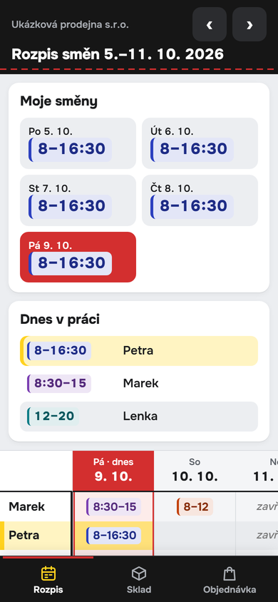
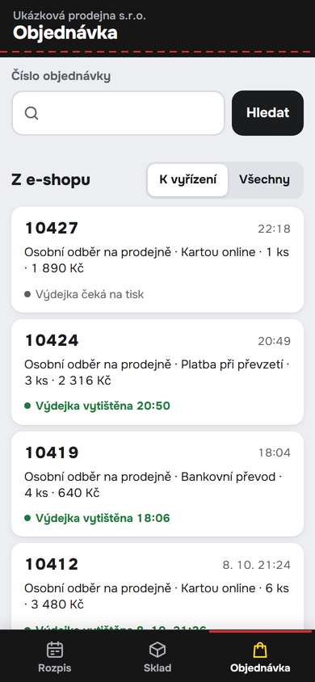
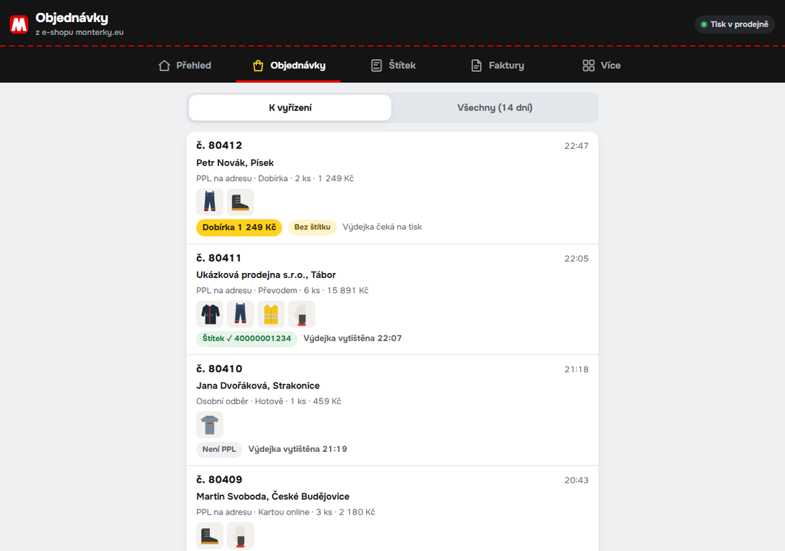
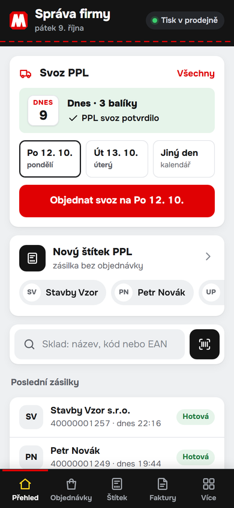
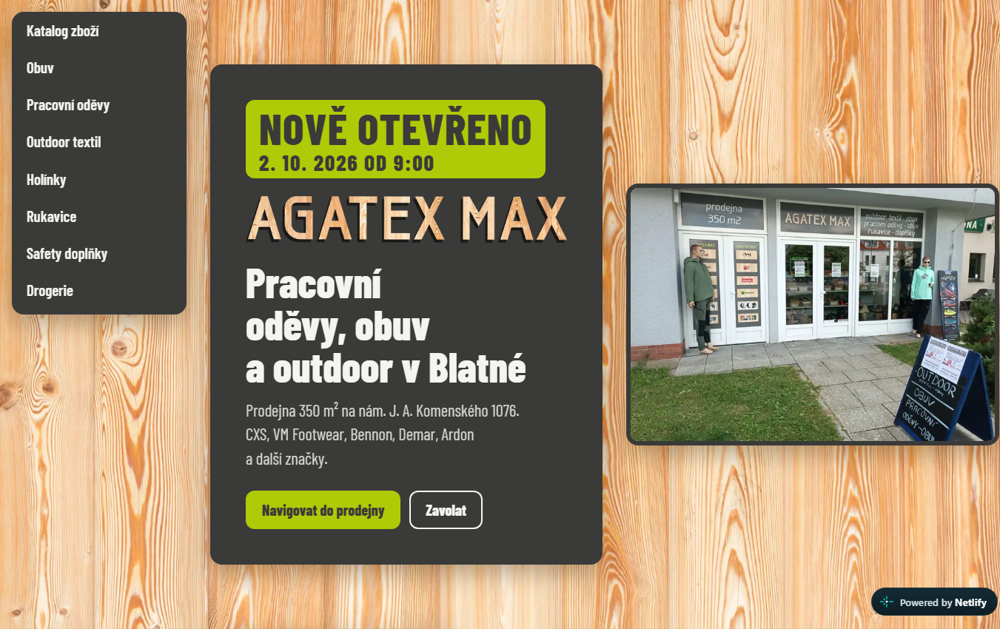
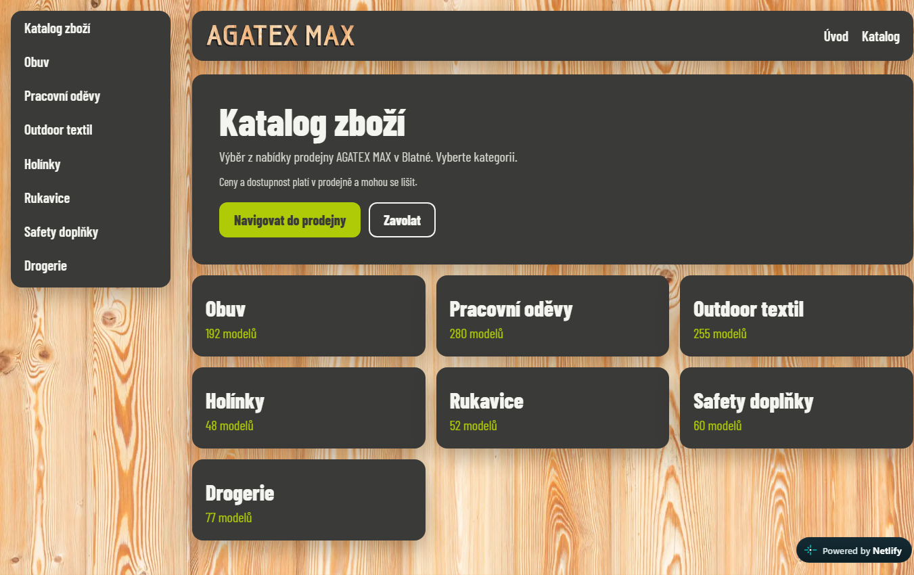
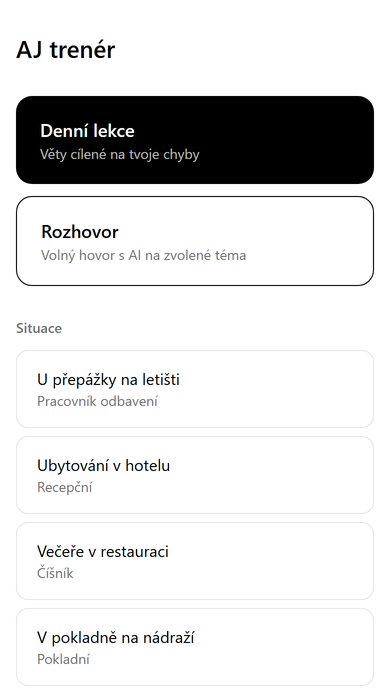

# Jaroslav Velek

**Česky** · [English below](#english)

## Web, e-shop, aplikace i automaty. Postavím, propojím a udržím v chodu.

Ve dvou rodinných firmách s pracovními oděvy a obuví (prodejna s e-shopem a velkoobchod) mám na starosti celý provoz.
Všechno, na čem firmy denně běží, jsem postavil sám: od webu přes aplikace pro zaměstnance až po faktury, které se naskladní samy.

**→ Napište mi, co potřebujete: [jaravelin@gmail.com](mailto:jaravelin@gmail.com?subject=Popt%C3%A1vka%3A%20web%2C%20aplikace%20nebo%20automatizace)**
Do 2 pracovních dnů odpovím, jestli to jde a zhruba za kolik.

**Z provozu za posledních 11 týdnů** (22. 7. – 9. 10. 2026):

| 151 faktur | 4 368 řádků | 725 objednávek | 1 900+ karet |
|:-:|:-:|:-:|:-:|
| naskladněných automaticky, bez ručního zásahu | které nikdo nepřepisoval, zhruba 75–150 hodin práce | u 15 dodavatelů připravených automaticky | nového zboží založených v pokladně programem |

**Všechno, co malá firma potřebuje, napojené dohromady:** aplikace na míru pro cokoli (pro zaměstnance, zákazníky i vlastní provoz, klidně s AI) · weby a e-shopy napojené na sklad · automatizace (faktury, objednávky, dopravci, platby).

---

### Rozpis směn pořád na papíře a v Excelu?

Appka navrhne rozpis na týden podle rolí a otevírací doby. Zaměstnanci ho mají v telefonu a směnu si mezi sebou vymění
sami: jeden navrhne, druhý přijme a oba dostanou upozornění. Rozpis se jedním klikem převede do docházky a z ní vzniknou
výplatní pásky a podklady pro účetního.

Od 8. 10. 2026 je v téže appce i **Prodejna**: zaměstnanec má v telefonu nebo na tabletu za pultem sklad podle velikostí
se skenerem kódů v kameře, tisk cenovky a objednávky z e-shopu k vyzvednutí. Směny jsou barevně podle šablon.

  
  

Na snímcích je ukázková verze s vymyšlenou firmou. [Ukázka kódu: payroll-shift-planner](https://github.com/jaravelin-dot/payroll-shift-planner)

### Objednávky, štítky, svoz a faktury pořád v pěti různých systémech?

**Správa firmy** dá majiteli provoz na jedno místo, v telefonu i na počítači: objednávky z e-shopu, štítek dopravce
a svoz jedním klikem, faktury od dodavatelů a jejich naskladnění, sklad a cenovky. V provozu od 9. 10. 2026,
nahradila chatovacího bota a instaluje se jako appka na plochu.

  
  

Na snímcích jsou vymyšlená data, kód appky je neveřejný.

### Přepisujete faktury od dodavatelů do pokladny?

Faktura přijde e-mailem, automat ji přečte (PDF i ISDOC), spáruje položky s katalogem podle EAN a zboží naskladní.
Nové zboží dostane kartu, sporné řádky přijdou ke kontrole. Ručně to dřív byla **půlhodina až hodina na fakturu**.

[Ukázka kódu: invoice-to-stock](https://github.com/jaravelin-dot/invoice-to-stock)

### Objednáváte u dodavatelů ručně, velikost po velikosti?

Ze skladu a prodejů se spočítá, co a v jakých velikostech doobjednat. Robot to vloží do košíků na B2B portálech
dodavatelů a člověk jen zkontroluje a odešle.

[Ukázka kódu: supplier-order-automation](https://github.com/jaravelin-dot/supplier-order-automation)

### Potřebujete e-shop, který ví, co máte skladem?

[www.monterky.eu](https://www.monterky.eu) je napojený na pokladnu a sklad prodejny, dopravce, platby a srovnávače zboží.
Zákazník nemusí vědět, jak se věc jmenuje: AI poradce Monty vybere podle popisu práce a velikosti.

  
  

[Funkce e-shopu a ukázka v prohlížeči: woocommerce-store-showcase](https://github.com/jaravelin-dot/woocommerce-store-showcase)

### Chcete firemní web, na kterém je vidět, co prodáváte?

Web prodejny [agatex-max.cz](https://agatex-max.cz) má katalog 964 modelů v sedmi kategoriích. Katalog se generuje z dat o zboží,
takže se při změně sortimentu nic nepřepisuje ručně. Na mobilu má zákazník po ruce navigaci do prodejny a telefon.

  
  

### Běhá prodavač do skladu zjistit, jestli máte 43?

Zeptá se telefonu, dostane sklad, cenu i stav objednávky a rovnou vytiskne cenovku. Začínalo to jako chatovací asistent,
dnes je to součást appky Prodejna.

[Ukázka kódu: store-assistant-bot](https://github.com/jaravelin-dot/store-assistant-bot)

### Máte nápad na vlastní aplikaci?

AJ trenér je moje aplikace na trénink anglické výslovnosti. Hodnotí výslovnost po jednotlivých hláskách, skládá denní lekce
z vět, ve kterých děláte chyby, a umí s vámi mluvit hlasem s umělou inteligencí. Na telefonu se instaluje z prohlížeče
na plochu jako běžná aplikace. [Vyzkoušet AJ trenéra](https://aj-trener.vercel.app)

---

### Jak spolupráce probíhá

1. **Napíšete mi, co potřebujete.** Stačí pár vět, nic nepřipravujte.
2. **Do 2 pracovních dnů odpovím**, jestli to jde a zhruba za kolik.
3. **Postavím to a nasadím**, na vašich datech a s vašimi systémy. Údržbu domluvíme předem.

**[Napsat e-mail →](mailto:jaravelin@gmail.com?subject=Popt%C3%A1vka%3A%20web%2C%20aplikace%20nebo%20automatizace)**

Pro techniky: Python, PHP/WooCommerce, TypeScript, React, Cloudflare Workers + D1, Playwright, Claude API, SQLite, REST API pokladen a dopravců.
Každé repo je spustitelná ukázka nad vymyšlenými daty; ostrý kód a data zůstávají neveřejné.

---

## English · Websites, online shops, apps and automation. I build it, connect it and keep it running.

I run the operations of two family businesses in workwear and safety footwear (a retail store with an online shop and a
wholesale company). I built everything they run on every day: from the website to apps for staff to invoices that put goods into stock by themselves.

**→ Tell me what you need: [jaravelin@gmail.com](mailto:jaravelin@gmail.com?subject=Project%20enquiry)** — I'll reply
within 2 business days with whether it can be done and a rough price. Also open to remote roles.

**From production, last 11 weeks** (22 Jul – 9 Oct 2026):

| 151 invoices | 4,368 lines | 725 orders | 1,900+ products |
|:-:|:-:|:-:|:-:|
| put into stock automatically, no manual fixes | nobody had to retype, roughly 75–150 hours | across 15 suppliers, prepared automatically | created in the POS by code |

| Problem | What I built | Code |
|---|---|---|
| Shift schedule on paper and in spreadsheets | A staff app: weekly schedule on phones, shift swaps with notifications, attendance, payslips and accountant exports; from 8 Oct 2026 also stock by size with a camera barcode scanner, price tags and online-shop pickups | [payroll-shift-planner](https://github.com/jaravelin-dot/payroll-shift-planner) |
| Orders, labels, pickups and invoices in five different systems | An owner app (live from 9 Oct 2026): online-shop orders, carrier labels and pickups in one tap, supplier invoices into stock, stock and price tags, on phone and desktop | private |
| Retyping supplier invoices into the POS (30–60 min each) | E-mail → PDF/ISDOC parsing → EAN & catalogue matching → stock in the POS, unclear lines go to review | [invoice-to-stock](https://github.com/jaravelin-dot/invoice-to-stock) |
| Reordering from suppliers size by size | Stock & sales decide what to reorder; a browser robot fills the carts on supplier B2B portals; a human approves | [supplier-order-automation](https://github.com/jaravelin-dot/supplier-order-automation) |
| An online shop that doesn't know your stock | [www.monterky.eu](https://www.monterky.eu) — WooCommerce wired to POS, stock, carriers, payments, price comparison, with an AI product advisor | [woocommerce-store-showcase](https://github.com/jaravelin-dot/woocommerce-store-showcase) |
| A company website that shows what you sell | [agatex-max.cz](https://agatex-max.cz) — a store website with a 964-model catalogue generated from product data | — |
| Staff running to the stockroom | A phone assistant for stock, prices and order status, with price-tag printing | [store-assistant-bot](https://github.com/jaravelin-dot/store-assistant-bot) |
| An idea for your own app | [AJ trenér](https://aj-trener.vercel.app) — a pronunciation trainer that scores every sound and holds voice conversations with AI | — |

**Stack:** Python, PHP/WooCommerce, TypeScript, React, Cloudflare Workers + D1, Playwright, Claude API, SQLite, POS & carrier REST APIs.
Each repo is a runnable demo on made-up data; production code and data stay private.
