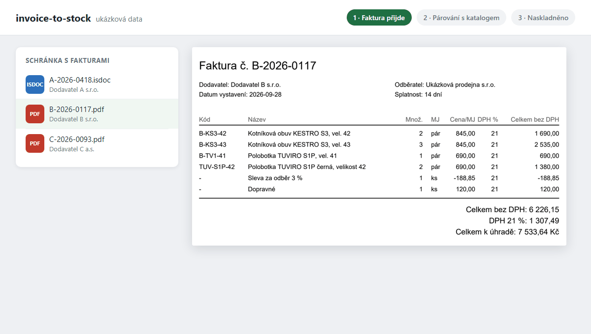
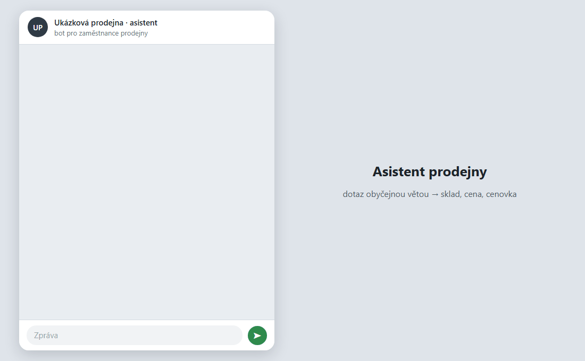
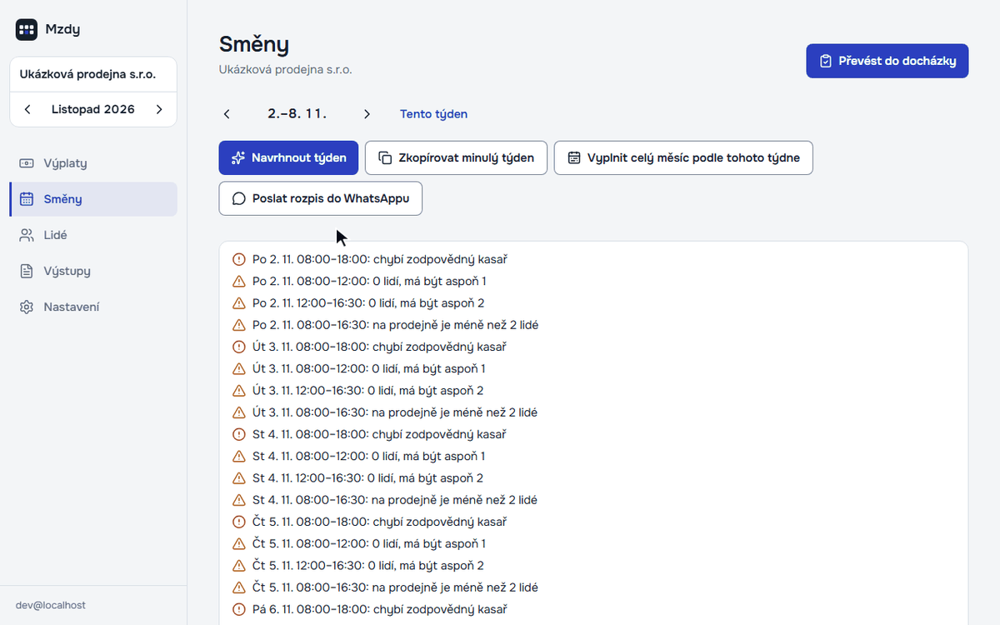
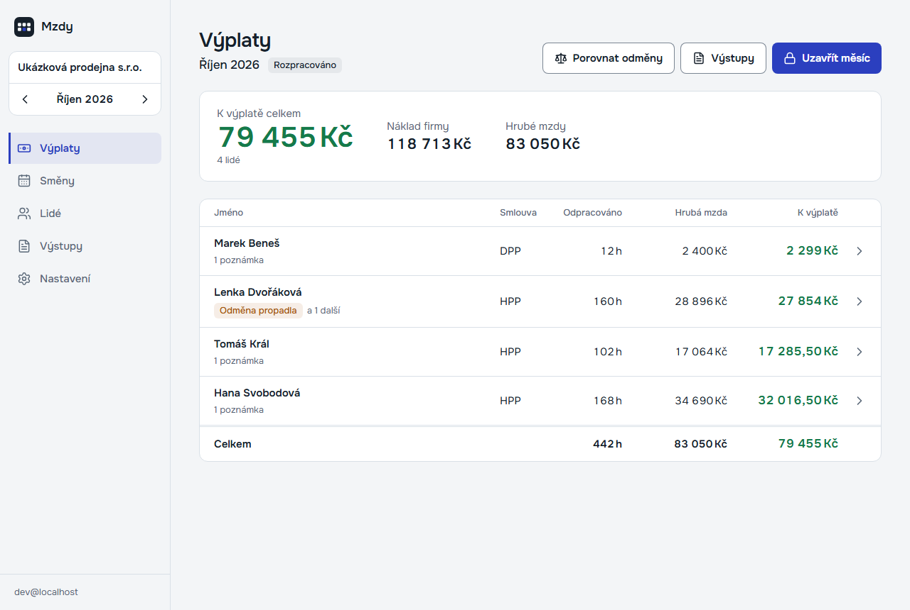

# Jaroslav Velek

**Česky** · [English below](#english)

## Co se ve vaší firmě každý den přepisuje ručně, to naučím dělat počítač.

Ve dvou rodinných firmách s pracovními oděvy a obuví (prodejna s e-shopem a velkoobchod) mám na starosti celý provoz.
Všechno níže jsem postavil sám a denně na tom běží naše tržby.

**→ Napište mi, co vás zdržuje: [jaravelin@gmail.com](mailto:jaravelin@gmail.com?subject=Automatizace%20pro%20moji%20firmu)**
Do 2 pracovních dnů odpovím, jestli to jde zautomatizovat a zhruba za kolik.

**Z provozu za posledních 11 týdnů** (22. 7. – 8. 10. 2026):

| 149 faktur | 4 287 řádků | 703 objednávek | 1 900+ karet |
|:-:|:-:|:-:|:-:|
| naskladněných automaticky, bez ručního zásahu | které nikdo nepřepisoval, zhruba 75–150 hodin práce | u 15 dodavatelů připravených automaticky | nového zboží založených v pokladně programem |

---

### Přepisujete faktury od dodavatelů do pokladny?

Faktura přijde e-mailem, automat ji přečte (PDF i ISDOC), spáruje položky s katalogem podle EAN a zboží naskladní.
Nové zboží dostane kartu, sporné řádky přijdou ke kontrole. Ručně to dřív byla **půlhodina až hodina na fakturu**.

[Ukázka kódu: invoice-to-stock](https://github.com/jaravelin-dot/invoice-to-stock)

### Objednáváte u dodavatelů ručně, velikost po velikosti?

Ze skladu a prodejů se spočítá, co a v jakých velikostech doobjednat. Robot to vloží do košíků na B2B portálech
dodavatelů a člověk jen zkontroluje a odešle.

[Ukázka kódu: supplier-order-automation](https://github.com/jaravelin-dot/supplier-order-automation)

### Potřebujete e-shop, který ví, co máte skladem?

[www.monterky.eu](https://www.monterky.eu) je napojený na pokladnu a sklad prodejny, dopravce, platby a srovnávače zboží.
Zákazník nemusí vědět, jak se věc jmenuje: AI poradce Monty vybere podle popisu práce a velikosti.

  
  

[Funkce e-shopu a ukázka v prohlížeči: woocommerce-store-showcase](https://github.com/jaravelin-dot/woocommerce-store-showcase)

### Běhá prodavač do skladu zjistit, jestli máte 43?

Zeptá se telefonu, dostane sklad, cenu i stav objednávky a rovnou vytiskne cenovku.

[Ukázka kódu: store-assistant-bot](https://github.com/jaravelin-dot/store-assistant-bot)

### Mzdy a směny v Excelu?

Výplaty podle českých zákonů, výplatní pásky, podklady pro účetní a rozpis směn, který se jedním klikem převede do docházky.

Na snímcích je ukázková verze s vymyšlenou firmou. [Ukázka kódu: payroll-shift-planner](https://github.com/jaravelin-dot/payroll-shift-planner)

---

### Jak spolupráce probíhá

1. **Napíšete mi, co vás zdržuje.** Stačí pár vět, nic nepřipravujte.
2. **Do 2 pracovních dnů odpovím**, jestli to jde zautomatizovat a zhruba za kolik.
3. **Postavím to nad vašimi daty** a nasadím. Pokud dodavatel změní portál nebo pokladna API, domluvíme se na údržbě.

**[Napsat e-mail →](mailto:jaravelin@gmail.com?subject=Automatizace%20pro%20moji%20firmu)**

Pro techniky: Python, PHP/WooCommerce, TypeScript, Cloudflare Workers + D1, Playwright, Claude API, SQLite, REST API pokladen a dopravců.
Každé repo je spustitelná ukázka nad vymyšlenými daty; ostrý kód a data zůstávají neveřejné.

---

## English · If someone in your business retypes the same data every day, I'll teach a computer to do it.

I run the operations of two family businesses in workwear and safety footwear (a retail store with an online shop and a
wholesale company). I built everything below myself, and our revenue runs on it every day.

**→ Tell me what slows you down: [jaravelin@gmail.com](mailto:jaravelin@gmail.com?subject=Automation%20project)** — I'll reply
within 2 business days with whether it can be automated and a rough price. Also open to remote roles.

**From production, last 11 weeks** (22 Jul – 8 Oct 2026):

| 149 invoices | 4,287 lines | 703 orders | 1,900+ products |
|:-:|:-:|:-:|:-:|
| put into stock automatically, no manual fixes | nobody had to retype, roughly 75–150 hours | across 15 suppliers, prepared automatically | created in the POS by code |

| Problem | What I built | Code |
|---|---|---|
| Retyping supplier invoices into the POS (30–60 min each) | E-mail → PDF/ISDOC parsing → EAN & catalogue matching → stock in the POS, unclear lines go to review | [invoice-to-stock](https://github.com/jaravelin-dot/invoice-to-stock) |
| Reordering from suppliers size by size | Stock & sales decide what to reorder; a browser robot fills the carts on supplier B2B portals; a human approves | [supplier-order-automation](https://github.com/jaravelin-dot/supplier-order-automation) |
| An online shop that doesn't know your stock | [www.monterky.eu](https://www.monterky.eu) — WooCommerce wired to POS, stock, carriers, payments, price comparison, with an AI product advisor | [woocommerce-store-showcase](https://github.com/jaravelin-dot/woocommerce-store-showcase) |
| Staff running to the stockroom | A phone assistant for stock, prices and order status, with price-tag printing | [store-assistant-bot](https://github.com/jaravelin-dot/store-assistant-bot) |
| Payroll and shifts in spreadsheets | Czech payroll, payslips, accountant exports, a shift planner that turns into attendance | [payroll-shift-planner](https://github.com/jaravelin-dot/payroll-shift-planner) |

**Stack:** Python, PHP/WooCommerce, TypeScript, Cloudflare Workers + D1, Playwright, Claude API, SQLite, POS & carrier REST APIs.
Each repo is a runnable demo on made-up data; production code and data stay private.
