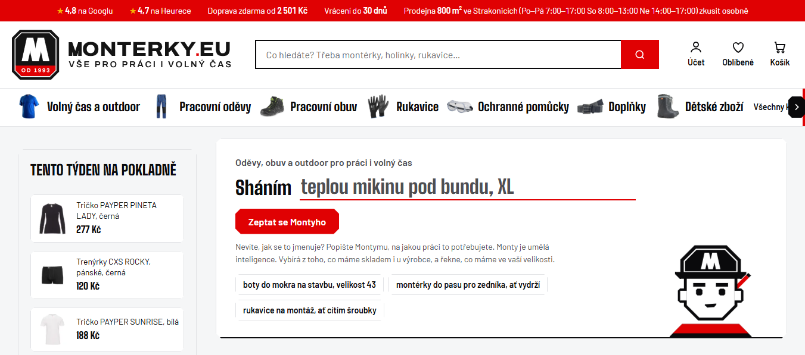
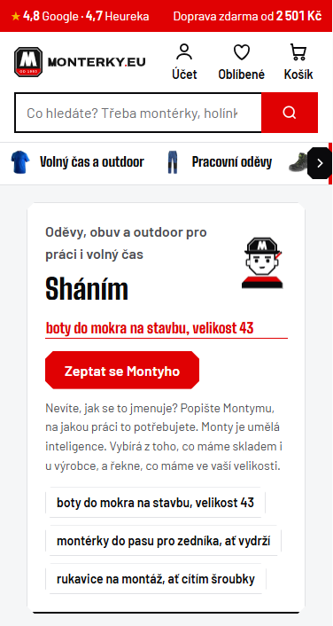

# Jaroslav Velek

**Česky** · [English below](#english)

**Automatizuju práci malých firem a e-shopů: faktury, sklad, objednávky u dodavatelů, mzdy a e-shop napojený na pokladnu.**
Všechno níže je nasazené v reálném provozu v maloobchodu s pracovními oděvy (2 firmy, desítky automatických úloh denně).

## Ostrý provoz: [www.monterky.eu](https://www.monterky.eu)

E-shop na WooCommerce napojený na pokladnu a sklad prodejny, dopravce, platby a srovnávače zboží.
Zákazník nemusí vědět, jak se věc jmenuje: AI poradce Monty vybere podle popisu práce a velikosti
z toho, co je skladem u nás nebo u výrobce.

  
  

## Ukázky kódu

Každé repo je spustitelná ukázka nad vymyšlenými daty. Ostrý kód a data zůstávají neveřejné.

| Repo | Co řeší |
|---|---|
| [invoice-to-stock](https://github.com/jaravelin-dot/invoice-to-stock) | Faktura od dodavatele přijde e-mailem a zboží je naskladněné v pokladně. Nikdo nic nepřepisuje. |
| [supplier-order-automation](https://github.com/jaravelin-dot/supplier-order-automation) | Spočítá, co a v jakých velikostech doobjednat, a robot to vloží do košíků na B2B portálech dodavatelů. |
| [store-assistant-bot](https://github.com/jaravelin-dot/store-assistant-bot) | Prodavač se zeptá telefonu na sklad, ceny a objednávky; cenovky vytiskne do PDF. |
| [payroll-shift-planner](https://github.com/jaravelin-dot/payroll-shift-planner) | Mzdy podle českých zákonů, výplatní pásky, podklady pro účetní a plánovač směn. |
| [woocommerce-store-showcase](https://github.com/jaravelin-dot/woocommerce-store-showcase) | Funkce e-shopu výše a vybrané moduly, s ukázkou, kterou vyzkoušíte přímo v prohlížeči. |

## Kontakt

**Chcete něco podobného pro svou firmu?** Napište mi: [jaravelin@gmail.com](mailto:jaravelin@gmail.com)

---

## English

**I automate the work of small businesses and online shops: supplier invoices, stock, reordering, payroll, and an online shop connected to the point of sale.**
Everything below runs in real operation in workwear retail (2 companies, dozens of automated tasks a day).

**In production: [www.monterky.eu](https://www.monterky.eu)** (screenshots above) — a WooCommerce shop connected to the store's
POS and stock, carriers, payments and price-comparison sites, with an AI advisor that picks products from a plain description
of the job and the customer's size.

**Code samples** — each repo is a runnable demo on made-up data; production code and data stay private:
[invoice-to-stock](https://github.com/jaravelin-dot/invoice-to-stock) ·
[supplier-order-automation](https://github.com/jaravelin-dot/supplier-order-automation) ·
[store-assistant-bot](https://github.com/jaravelin-dot/store-assistant-bot) ·
[payroll-shift-planner](https://github.com/jaravelin-dot/payroll-shift-planner) ·
[woocommerce-store-showcase](https://github.com/jaravelin-dot/woocommerce-store-showcase)

**Want something similar for your business?** [jaravelin@gmail.com](mailto:jaravelin@gmail.com)
